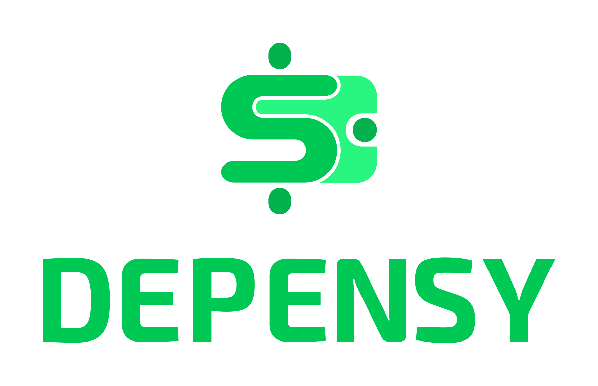

# Depensy :moneybag: :bar_chart:

#### (Project still in early stage!!!)

<h1 align=center>

</h1>

Depensy :moneybag: is a work-in progress simple budget management app - features latest android technologies.

## Architecture
This app is build following the diagram bellow. To learn more about this [architecture](https://developer.android.com/jetpack/docs/guide#separation-of-concerns)

Getting Started
---------------
This project uses the Gradle build system. To build this project, use the
`gradlew build` command or use "Import Project" in Android Studio.

For more resources on learning Android development, visit the
[Developer Guides](https://developer.android.com/guide/) at
[developer.android.com](https://developer.android.com).

Screenshots
-----------

(Coming soon...)

Libraries Used
--------------
* [Foundation][0] - Components for core system capabilities, Kotlin extensions and support for
  multidex and automated testing.
  * [AppCompat][1] - Degrade gracefully on older versions of Android.
  * [Android KTX][2] - Write more concise, idiomatic Kotlin code.
  * [Test][4] - An Android testing framework for unit and runtime UI tests.
* [Architecture][10] - A collection of libraries that help you design robust, testable, and
  maintainable apps. Start with classes for managing your UI component lifecycle and handling data
  persistence.
  * [Data Binding][11] - Declaratively bind observable data to UI elements.
  * [Lifecycles][12] - Create a UI that automatically responds to lifecycle events.
  * [LiveData][13] - Build data objects that notify views when the underlying database changes.
  * [Navigation][14] - Handle everything needed for in-app navigation.
  * [Room][16] - Access your app's SQLite database with in-app objects and compile-time checks.
  * [ViewModel][17] - Store UI-related data that isn't destroyed on app rotations. Easily schedule
     asynchronous tasks for optimal execution.
* [UI][30] - Details on why and how to use UI Components in your apps - together or separate
  * [Animations & Transitions][31] - Move widgets and transition between screens.
  * [Fragment][34] - A basic unit of composable UI.
  * [Layout][35] - Lay out widgets using different algorithms.
* Third party
  * [Kotlin Coroutines][91] for managing background threads with simplified code and reducing needs for callbacks
  * Third party
  * [Material Dialogs][92] :heart_eyes: A beautiful and fluid dialogs API for Kotlin & Android

[0]: https://developer.android.com/jetpack/foundation/
[1]: https://developer.android.com/topic/libraries/support-library/packages#v7-appcompat
[2]: https://developer.android.com/kotlin/ktx
[4]: https://developer.android.com/training/testing/
[10]: https://developer.android.com/jetpack/arch/
[11]: https://developer.android.com/topic/libraries/data-binding/
[12]: https://developer.android.com/topic/libraries/architecture/lifecycle
[13]: https://developer.android.com/topic/libraries/architecture/livedata
[14]: https://developer.android.com/topic/libraries/architecture/navigation/
[16]: https://developer.android.com/topic/libraries/architecture/room
[17]: https://developer.android.com/topic/libraries/architecture/viewmodel
[30]: https://developer.android.com/jetpack/ui/
[31]: https://developer.android.com/training/animation/
[34]: https://developer.android.com/guide/components/fragments
[35]: https://developer.android.com/guide/topics/ui/declaring-layout
[91]: https://kotlinlang.org/docs/reference/coroutines-overview.html
[92]: https://github.com/afollestad/material-dialogs

#### Contributors
* [Farouk](https://github.com/sabiou) : Project manager / dev
* [Zularizal](https://github.com/zularizal) : Designer
